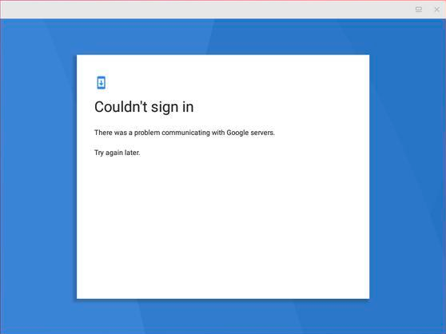

> Anbox是一种基于容器在常规GNU/Linux系统上启动完整Android系統的方法，如Ubuntu。
Anbox 使用 Linux 命名空间机制（user，pid，uts，net，mount，ipc），在容器中运行完整的 Android 系统，容器内的 Android 没有直接访问任何硬件的权限，所有的硬件访问通过主机上的 anbox 守护进程。Anbox复用基于 QEMU 的模拟器中为 Android 所做的 OpenGL ES 加速渲染的实现。容器内的 Android 系统使用不同的管道与主机系统通信，并通过它们发送所有的硬件访问命令。<br>

---

## 使用apt和snap安装Anbox

- [安装内核模块](https://docs.anbox.io/userguide/install_kernel_modules.html)

  anbox-modules-dkms包含ashmem和binder内核模块，安装anbox-modules-dkms后，必须手动加载内核模块。下次系统启动时，它们将自动加载。

 ```
 $ sudo add-apt-repository ppa:morphis/anbox-support
 $ sudo apt update
 $ sudo apt install linux-headers-generic anbox-modules-dkms
 $ sudo modprobe ashmem_linux
 $ sudo modprobe binder_linux
 $ ls -1 /dev/{ashmem,binder}
 /dev/ashmem
 /dev/binder
 ```

- 安装和更新Anbox snap

 ```
 $ sudo apt install snapd
 $ sudo snap install --devmode --beta anbox
 $ snap refresh --beta --devmode anbox
 ```

- 查看当前可用的Anbox信息

 `$ snap info anbox`

- 启动Anbox

 `$ anbox.appmgr`

 Anbox启动后，应用管理器界面如下所示：
 

 点击应用管理器中的Settings的图标，启动Settings，界面如下所示：
 

- 安装安卓应用

 ```
 $ sudo apt install android-tools-adb
 $ adb install qq.apk
 37616 KB/s (71677112 bytes in 1.860s)
 Failure [INSTALL_FAILED_NO_MATCHING_ABIS: Failed to extract native libraries,        res=-113]
 ```
 上面执行`adb install qq.apk`报错了，原因是当前机器为x86结构，如果是在arm64上，则不会出现该问题。如果想在x86下安装apk，需要找x86的包，可以从[apk mirror](https://mirrorapk.net/)下载，当然，这里的包根本无法满足我的需要，很可能也满足不了你的需要。那么，问题来了，想在x86下使用应用商店的那些apk（arm版本），有没有什么办法呢？

 办法总比困难多，这里可以使用 **libhoudini**。当然，在集成 libhoudini 来支持 ARM 后，也并非所有 Android 应用和游戏都能在 Anbox 中运行。某些 Android 应用和游戏可能根本不会出现在 Google Play 商店中，而一些应用和游戏可能可以安装但无法使用。此外，某些应用可能无法使用某些功能。默认情况下，Anbox 没有 Google Play 商店或 ARM 应用支持。要安装应用，必须下载每个应用的 APK 并使用 adb 手动安装。如上面提及的安装报错，默认情况下不能使用 Anbox 安装 ARM 应用或游戏，可以在 Anbox 中手动设置 Google Play 商店和 ARM 应用支持（使用 libhoudini），但该过程较复杂。为了更容易地在 Anbox 上安装 Google Play 商店和 Google Play 服务，并让它支持 ARM 应用程序和游戏（使用 libhoudini）， geeks-r-us.de上有人创建了一个自动执行这些任务的脚本。

    - 安装 Google Play 商店并在 Anbox 上启用 ARM 应用/游戏支持

    1、 安装所需的依赖项（wget、lzip、unzip 和 squashfs-tools）

    `sudo apt install wget lzip unzip squashfs-tools dnsmasq`

    2、 下载并运行脚本，在 Anbox 上自动下载并安装 Google Play 商店（和 Google Play 服务）和 libhoudini（用于 ARM 应用/游戏支持），也可以直接从我的git上下载该脚本[install-playstore.sh](https://github.com/eightplus/examples/tree/master/scripts/install-playstore)

    ```
    wget https://raw.githubusercontent.com/geeks-r-us/anbox-playstore-installer/master/install-playstore.sh
    chmod +x install-playstore.sh
    sudo ./install-playstore.sh
    ```
    3、要让 Google Play 商店在 Anbox 中运行，你需要启用 Google Play 商店和 Google Play 服务的所有权限，运行Anbox

    `$ anbox.appmgr`

    然后进入“设置 > 应用 > Google Play 服务 > 权限”并启用所有可用权限。对 Google Play 商店也一样。至此，应该可以使用 Google 帐户登录 Google Play 商店了。
    

    如果未启用 Google Play 商店和 Google Play 服务的所有权限，你可能会在尝试登录 Google 帐户时可能会遇到问题，并显示以下错误消息：“Couldn’t sign in. There was a problem communicating with Google servers. Try again later“，如你在下面的截图中看到的那样：
    

    登录后，你可以停用部分 Google Play 商店/Google Play 服务权限。如果在 Anbox 上登录 Google 帐户时遇到一些连接问题，请确保 anbox-bride.sh 正在运行：

    启动：
    `$ sudo /snap/anbox/current/bin/anbox-bridge.sh start`

    重启：
    `$ sudo /snap/anbox/current/bin/anbox-bridge.sh restart`

- 卸载Anbox

 ```
 $ snap remove anbox
 $ sudo apt install ppa-purge
 $ sudo ppa-purge ppa:morphis/anbox-support
 ```


## 参考文档

[Anbox主页](https://anbox.io/)

[Anbox代码托管](https://github.com/anbox)

[Android 硬件 OpenGL ES 模拟设计概述](https://www.wolfcstech.com/2017/09/16/opengles_android_emulation/)

[Android QEMU fast pipes](https://android.googlesource.com/platform/external/qemu/+/emu-master-dev/android/docs/ANDROID-QEMU-PIPE.TXT)

[The Android "qemud" multiplexing daemon](https://android.googlesource.com/platform/external/qemu/+/emu-master-dev/android/docs/ANDROID-QEMUD.TXT)

[Android qemud services](https://android.googlesource.com/platform/external/qemu/+/emu-master-dev/android/docs/ANDROID-QEMUD-SERVICES.TXT)
