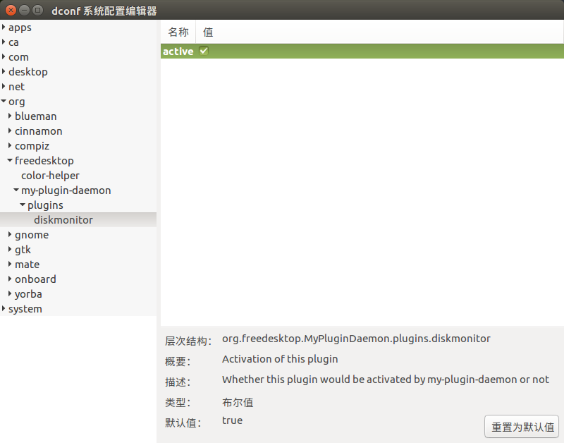

> 前面介绍过GLib、GObject和Dbus-glib，这里将在这些知识的基础上，结合Gtk图形库，完成一个插件（plugin）框架的搭建。该怎么通俗易懂的介绍这里的插件呢，左思右想，还是决定以GStreamer为例来简单介绍下插件（GStreamer是一个创建流媒体应用程序的框架，这家伙对于Linux下的音/视频播放、摄像头等方面有着很重要的地位和作用，如 GNOME 桌面的默认播放器rhythmbox，cheese摄像头等软件都是用的GStreamer。我本人啊，对这个东西真的是特别感兴趣，可惜目前业余时间恐怕难以深入分析，遗憾:cold_sweat:）。

> GStreamer 插件的工作原理同其他的基于插件的程序的工作原理类似，本质上都是通过读取动态库实现的，只需要每个动态库都实现某一个特定的接口就可以了，里面会有个像注册表一样的数据结构会存储所有的插件的信息。GStreamer 框架基于插件，有些插件中提供了各种各样的多媒体数字信号编解码器,也有些提供了其他的功能，所有的插件都能够被链接到任意的已经定义了的数据流管道中。元件是 GStreamer的核心，在 GStreamer 插件的开发中，一个元件就是继承于 GstElement 的一个对象，元件在与其他元件连接时提供了如下一些功能，比如：一个源元件为一个流提供数据，一个滤镜元件对流中的数据进行操作，也就是说没有了元件，GStreamer只是一堆概念性的管道，没有任何东西可供连接 。GStreamer 自带了一大堆元件，但我们也可以编写额外的元件，但仅仅编写新的元件并不够，为了使 GStreamer 能够使用它，就需要将元件封装到插件中。一个插件是一块可以加载的代码，通常被称为共享对象文件（shared object file）或动态链接库（dynamically linked library）。

> 说到这里，想必大家在概念上对插件有了初步认识。在编程方面，说到底就是插件可以让其他开发者在你的程序框架下开发更多的功能模块，而他们并不需要修改你的主程序，甚至不用怎么花心思去分析你的主程序。这样，你只需要编写一个框架，并提供一个插件示例，别人就能按照你的插件示例来编写其他插件，帮你的框架程序添砖加瓦，想想都轻松啊:laughing::laughing::laughing:

---

## 示例源码
- [my-plugin-daemon](https://github.com/eightplus/examples/tree/master/code/C/my-plugin-daemon)

## 示例代码编程要点简析

### 编译相关介绍
- 安装编译依赖

  `$ sudo apt install autotools-dev intltool libpolkit-agent-1-dev libpolkit-gobject-1-dev libdbus-glib-1-dev libdconf-dev libglib2.0-dev libgtk-3-dev mate-common`

- 编译和运行

  这里不是直接使用automake，而是使用mate-common提供的mate-autogen，比较方便，具体见 autogen.sh 文件，编译和运行命令如下所示：
  ```
  $ ./autogen.sh  --prefix=/usr
  $ make
  $ ./src/my-plugin-daemon --debug
  ```

- deb包

  具体见源码目录下debian文件夹里面的内容，这里不做过多描述，有问题的话，可以向我发邮件寻求帮助。deb包的指针可以使用命令 `debuild` 或者 `dpkg-buildpackage -rfakerooot -b`，相关命令执行如下所示：
  ```
  $ debuild
  $ sudo dpkg -i ../my-plugin-daemon_1.0.0_amd64.deb
  $ /usr/bin/my-plugin-daemon
  ```

- 查看包安装的文件列表
  ```
  $ dpkg -L my-plugin-daemon
  /.
  /usr
  /usr/share
  /usr/share/doc
  /usr/share/doc/my-plugin-daemon
  /usr/share/doc/my-plugin-daemon/changelog.gz
  /usr/share/glib-2.0
  /usr/share/glib-2.0/schemas
  /usr/share/glib-2.0/schemas/org.freedesktop.MyPluginDaemon.plugins.diskmonitor.gschema.xml
  /usr/include
  /usr/include/my-plugin-daemon
  /usr/include/my-plugin-daemon/my_daemon_client.h
  /usr/include/my-plugin-daemon/my_plugin.h
  /usr/bin
  /usr/bin/my-plugin-daemon
  /usr/lib
  /usr/lib/x86_64-linux-gnu
  /usr/lib/x86_64-linux-gnu/my-plugin-daemon
  /usr/lib/x86_64-linux-gnu/my-plugin-daemon/libdiskmonitor.so
  /usr/lib/x86_64-linux-gnu/my-plugin-daemon/diskmonitor.my-plugin
  ```

### 主框架的搭建
  相关代码见源码目录下src，文件列表如下：
  ```
  main.c
  Makefile.am
  my_daemon.c
  my_daemon.h
  my_module.c
  my_module.h
  my_plugin.c
  my_plugin.h
  my_plugin_info.c
  my_plugin_info.h
  org.freedesktop.myplugindaemon.xml
  ```
- dbus server

  在org.freedesktop.myplugindaemon.xml文件中，写了两个method和两个signal，start和stop分别表示启动插件加载和停止插件功能。PluginActivated和PluginDeactivated分别发送插件激活和停止的消息。这里注意下`<annotation name="org.freedesktop.DBus.GLib.CSymbol" value="my_daemon"/>`的value值，这个值表示通过工具dbus-binding-tool生成的绑定文件中callback相关的dbus_glib_marshal_xxx_BOOLEAN__POINTER中的xxx即为这个value值，不要将其和method的前缀混淆了，method的前缀是由dbus-binding-tool工具执行时"--prefix"参数指定的，生成的绑定文件中和前缀相关的代码如下所示：
  ```
  static const DBusGMethodInfo dbus_glib_my_daemon_methods[] = {
  { (GCallback) my_daemon_start, dbus_glib_marshal_my_daemon_BOOLEAN__POINTER, 0 },
  { (GCallback) my_daemon_stop, dbus_glib_marshal_my_daemon_BOOLEAN__POINTER, 40 },
  };
  ```

  这里定义了一个存放私有变量的结构体，需要定义一个配合这个结构体的宏MY_DAEMON_GET_PRIVATE(o) ，而且在类结构的构造函数中增加一句`g_type_class_add_private(klass, sizeof(MyDaemonPrivate));`，结构体变量如下所示：
  ```
  struct MyDaemonPrivate
  {
      DBusGConnection *connection;
      GSList *plugins;
  };
  ```

- plugins manager

  1. 加载插件

    从存放插件so的路径下读取so，读取插件对应的配置信息文件，绑定插件的信号，并将插件变量保存到上面提到的存放私有变量的结构体MyDaemonPrivate中的plugins中，方便对插件进行管理。

  2. 卸载插件

    一是调用插件的停止工作模块，二是清空存放私有变量的结构体MyDaemonPrivate中plugins中的插件变量。

### 编写插件

  这里就不对代码进行分析了，只简述下几个注意事项，相关代码见源码目录下src，文件列表如下：
  ```
  diskmonitor.my-plugin.in
  my_diskmonitor_dialog.c
  my_diskmonitor_plugin.c
  my_diskmonitor_space.c
  Makefile.am
  my_diskmonitor_dialog.h
  my_diskmonitor_plugin.h
  my_diskmonitor_space.h
  ```
  这里的设想是这样的，建立了一个plugins目录，里面存放各个插件的代码，每一个插件都作为一个子目录存在。所以，在plugins目录下需要编写Makefile.am文件，方便在源码编译时管理旗下各个插件子目录。同样，子目录里面的插件要编译，也需要各自写一饿Makefile.am。当然，写了Makefile.am，就要对应的编写其输出的Makefile的规则，否则编不出Makefile文件，拿什么来make呢，是吧。我们在configure.ac文件的 AC_OUTPUT 下增加plugins/Makefile和plugins/diskmonitor/Makefile，其中diskmonitor就是我示例代码的一个插件。configure.ac文件中AC_OUTPUT的具体详情如下所示：
  ```
  AC_OUTPUT([
  Makefile
  src/Makefile
  plugins/Makefile
  plugins/diskmonitor/Makefile
  po/Makefile.in
  ])
  ```

  在编译插件so的时候，终端会显示出一个警告，大致如下：
  ```
  dpkg-shlibdeps: 警告: debian/my-plugin-daemon/usr/lib/x86_64-linux-gnu/my-plugin-daemon/libdiskmonitor.so contains an unresolvable reference to symbol my_plugin_get_type: it's probably a plugin
  ```
  出现了这种情况的时候，我们不必担心插件除了什么问题，这仅仅是dpkg shlibdeps分析二进制使用符号集时的一个警告，具体详情可以查阅 [dpkg-shlibdeps](http://man7.org/linux/man-pages/man1/dpkg-shlibdeps.1.html)。

  在data目录下，我对插件diskmonitor增加了一个org.freedesktop.MyPluginDaemon.plugins.diskmonitor.gschema.xml.in文件，该文件是schemas配置文件，该文件在安装deb包后存放的最终路径为：/usr/share/glib-2.0/schemas/org.freedesktop.MyPluginDaemon.plugins.diskmonitor.gschema.xml，里面我只放了一个参数active，默认为true，意思是插件diskmonitor默认处于激活状态，插件管理模块在加载插件的时候将会读取这个值，用户可以随时更改该值，已达到控制该插件启用和停止的目地。修改schemas配置文件的值时，除了可以用gsettings api提供的函数，如g_settings_get_string、g_settings_set_string外，还可以使用gsettings命令，具体参照 [gsettings](https://www.freedesktop.org/software/gstreamer-sdk/data/docs/latest/gio/gsettings-tool.html)，当然还有更简单方便的办法，用图形工具 dconf-editor 来操作，如下所示：
  ```
  $ dconf-editor
  ```
  

  最后再提一个plugin最重要的点，在插件管理模块中的四个文件my_plugin.c、my_plugin.h、my_module.c和my_module.h非常关键，这四个文件关系着插件真在的加载、卸载和导入。

    1. my_plugin.h文件下有一个宏MY_PLUGIN_REGISTER，具体如下：
    ```
    #define MY_PLUGIN_REGISTER(PluginName, plugin_name)                 \
          G_DEFINE_DYNAMIC_TYPE (PluginName,                                     \
                                 plugin_name,                                    \
                                 MY_TYPE_PLUGIN)                      \
                                                                                 \
    G_MODULE_EXPORT GType                                                          \
    register_my_plugin(GTypeModule *type_module)                       \
    {                                                                              \
        plugin_name##_register_type(type_module);                             \
                                                                               \
        return plugin_name##_get_type();                                       \
    }
    ```

    2. my_module.c下有真在执行插件加载和卸载的两个函数
    ```
    static gboolean my_module_load(GTypeModule *gmodule)
    {
        MyModule *module;
        MyModuleRegisterFunc register_func;
        gboolean res;

        module = MY_MODULE(gmodule);

        g_debug("Loading %s", module->path);

        module->library = g_module_open(module->path, 0);

        if (module->library == NULL) {
            g_warning ("%s", g_module_error());
            return FALSE;
        }

        /* extract symbols from the lib */
        res = g_module_symbol(module->library, "register_my_plugin", (void *)&register_func);
        if (!res) {
            g_warning("%s", g_module_error());
            g_module_close(module->library);

            return FALSE;
        }

        g_assert(register_func);

        module->type = register_func(gmodule);

        if (module->type == 0) {
            g_warning("Invalid my plugin in module %s", module->path);
            return FALSE;
        }

        return TRUE;
    }

    static void my_module_unload (GTypeModule *gmodule)
    {
        MyModule *module = MY_MODULE(gmodule);

        g_debug("Unloading %s", module->path);

        g_module_close(module->library);

        module->library = NULL;
        module->type = 0;
    }
    ```

    3. 在每个插件的代码中都需要将my_plugin.h头文件include进来，且需要编写上面提到的插件宏MY_PLUGIN_REGISTER相关的register_my_plugin代码，如下所示：
    ```
    G_MODULE_EXPORT GType register_my_plugin(GTypeModule *module);
    ```
