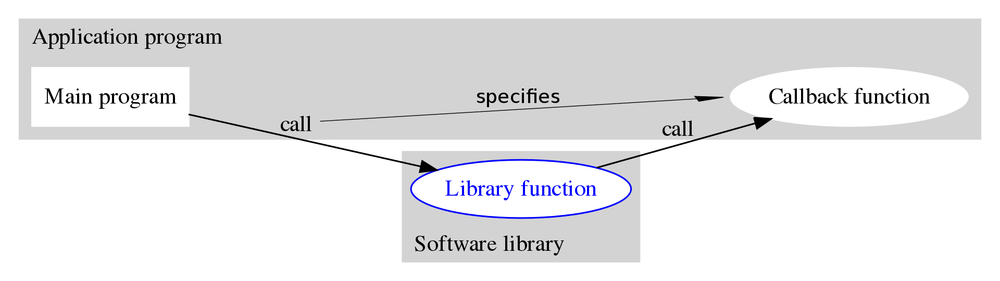

## 为什么学会写回调函数很重要？

  假设有两个程序，程序A为上层应用程序，程序B为底层驱动接口，当底层驱动接口B有数据变化时需要将变化的数据传输给上层应用A时，此时有两种方式：

  1)底层驱动接口B将变化的数据存放在接口函数中，上层应用A想调用的时候自己去调用B的接口获取变化的数据，即函数调用，此时主动权在上层应用A的手中。

  2)底层驱动接口B实现回调机制，当有数据变化需要传输给上层应用A的时候通知A来读取变化的数据，然后上层应用A在用户层的回调函数中读取变化的数据。此时主动权在底层驱动接口B的手中。

  我们知道，如果使用第一种方式，那么上层应用A根本就不知道底层驱动接口B中的数据在什么时候会发生变化，即不知道什么时候应该去调用底层驱动接口B的接口函数读取变化的数据；而使用第二种方式，上层应用A读取变化的数据的操作依赖于底层驱动接口B，只有底层驱动接口B呼叫上层应用A读该读取变化的数据了，上层应用A才会去读数据，即实现了中断读取。显然，在我们封装一些底层接口给别人使用的时候，实现回调函数将会派上很大的用场。

## 回调的定义和实现是怎样的？

  回调函数是指使用者自己定义一个函数，实现这个函数的程序内容，然后把这个函数（入口地址）作为参数传入别人的函数中，由别人的函数在运行时来调用的函数。即函数是你实现的，但由别人的函数在运行时通过参数传递的方式调用，这就是所谓的回调函数。

  拿上面提到上层应用A和底层驱动接口B来打比方，也就是说回调函数是一个通过函数指针调用的函数。上层应用A把函数的指针（入口地址）作为参数传递给底层驱动接口B，当这个指针所指向的函数在底层驱动接口B中被调用时(即上层应用A不是自己调用这个函数，而是将这个函数的函数指针通过底层驱动接口B的接口函数传到底层驱动接口B中，由底层驱动接口B来操控执行)。

  wiki上的介绍是这样的回调函数[Callback](https://en.wikipedia.org/wiki/Callback_(computer_programming))的：

  In computer programming, a callback, also known as a "call-after"[what-is-a-callback-function](https://stackoverflow.com/questions/824234/what-is-a-callback-function/7549753#7549753) function, is any executable code that is passed as an argument to other code that is expected to call back (execute) the argument at a given time. This execution may be immediate as in a synchronous callback, or it might happen at a later time as in an asynchronous callback. Programming languages support callbacks in different ways, often implementing them with subroutines, lambda expressions, blocks, or function pointers.
  

## 示例

  这里提供一个简单的示例 test.c，演示了四个回调函数，回调函数processFunction的参数为一个结构体，回调函数test1Function的参数为一个整形变量，回调函数test2Function和test3Function的参数都为一个字符串，但这两个回调函数的用法不一样，一个使用别名方式，一个使用指针方式。

  **后续计划将Github上的callback示例进行更新，将其封装成一个so供用户程序调用。**

  源码：[my-callback](https://github.com/eightplus/examples/tree/master/code/C/my-callback)
