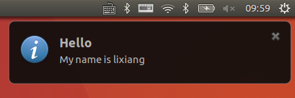

> 在Ubuntu系统上，我们经常可以看到如下图所示的消息框(Desktop Notification)，比如电池电量提醒和邮件消息提醒，通过调用org.freedesktop.Notifications这个DBUS服务提供的接口即可在桌面上弹出该消息框。消息框请求是异步的，通常构造消息框请求并发送后，用户就可以不再关心后续的信息，如果有特殊需要则可以自定义处理org.freedesktop.Notifications发送的信号。notification的介绍文档见：[https://developer.gnome.org/notification-spec/](https://developer.gnome.org/notification-spec/)


---

## 示例源码
- [notification](https://github.com/eightplus/examples/tree/master/code/Qt/notification)

## 开发库的安装
`$ sudo apt install qtbase5-dev qt5-qmake qtchooser qtscript5-dev qttools5-dev-tools qtbase5-dev-tools`

## 示例源码的编译和运行
```
$ qmake
$ make
$ ./notification
```

## org.freedesktop.Notifications 简介
  org.freedesktop.Notifications服务的消息框通常会包含如下的属性,其中Icon和Hints中的image_path必须为本地绝对路径或者file://开头的文件URL，也可以是桌面环境预定义图标名称，如dialog-information。

  | 名称 	             | 说明
  | -----------------  | ----------------------
  | Application Name   | 标示发送消息的程序，最好使用程序全名
  | Replaces ID 	     | 可选的消息ID，服务器通过id控制消息框的渲染，通常不用关注
  | Icon 	             | 显示在气泡框上的图标
  | Summary 	         | 标题，只能显示一行，叫title应该更合适
  | Body 	             | 消息体，支持部分HTML标签；`<b></b>`；`<i></i>`；`<u></u>`；`<a></a>`；``
  | Actions 	         | 显示一些按钮或者菜单（QAction），不过这一功能通常未被实现
  | Hints 	           | 为消息体提供的额外数据，比如显示在屏幕的位置（x，y坐标）
  | Expiration Timeout |气泡框显示的时长，单位毫秒；指定为-1时行为取决于实现；为0时气泡框将一直显示在桌面上直到用户点击

  消息框还有三个紧急程度可供选择：

  | 名称 	   |    值 	 |   说明
  | -------- | ------- | -------------------------------------------------------------
  | Low 	   |   	0    | 默认值，可以设置如何显示，应该设置一个合理的显示时间以便气泡框可以隐藏退出
  | Normal 	 |    1    | 同low
  | Critical | 	  2	   | 代表重要通知，不应该自动过期隐藏

## 示例代码分析要点
  如下代码段演示了Qt如何去调用org.freedesktop.Notifications这个dbus服务的Notify方法，传递的参数是`QList<QVariant>``类型，参数中包括了上面提到的一些属性，如Application Name， Replaces ID和Icon等。
  ```
  QDBusInterface notification("org.freedesktop.Notifications",
                              "/org/freedesktop/Notifications",
                              "org.freedesktop.Notifications",
                              QDBusConnection::sessionBus());

  QList<QVariant> args;
  args << (QCoreApplication::applicationName())   // appname
      << ((unsigned int) 0)                       // replaces id
      << QString("dialog-information")            // icon
      << tr("Test notification")                  // summary (notification title)
      << tr("Hello, My name is lixiang")          // body
      << QStringList()                            // actions
      << QVariantMap()                            // hints
      << (int) -1;                                // timeout

  notification.callWithArgumentList(QDBus::AutoDetect, "Notify", args);
  ```

## 其他语言弹出消息框
  除了示例代码使用Qt弹出消息框之外，其他语言和脚本同样可以实现该功能，具体参考：[https://wiki.archlinux.org/index.php/Desktop_notifications#Usage_in_programming](https://wiki.archlinux.org/index.php/Desktop_notifications#Usage_in_programming)，这里还简要提及下两种方法，如下所示：

  1. notify-send

  在Ubuntu下使用notify-send，需安装libnotify-bin包（`sudo apt install libnotify-bin`）,notify-send的文档见：[https://ss64.com/bash/notify-send.html]((https://ss64.com/bash/notify-send.html))
  ```
  # notify-send title body [options]
  notify-send "Hello" "My name is lixiang" -i dialog-information -t 10000
  ```

  2. python调用

  ```
  #!/usr/bin/python
  import gi
  gi.require_version('Notify', '0.7')
  from gi.repository import Notify
  Notify.init("demo")
  Hello = Notify.Notification.new("Hello", "My name is lixiang.", "dialog-information")
  Hello.show()
  ```
