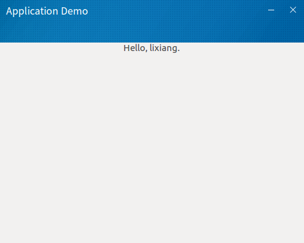

> GtkApplication可以让我们的核心程序代码与main()函数分开，这样可以让main()简单化，里面只需要创建GtkApplication对象并运行它，而其他图形相关的操作则在GtkApplication发出的信号中完成。GtkApplication对象默认是一个单例，程序启动后的第一个实例为主实例，远程实例是除主实例外的其他运行实例。当用户偿试打开第二个GtkApplication对象单例时，GtkApplication将发信号到主实例，主实例将再次收到activate或open信号，这种情况下，第二个实例将马上退出，不调用startup或shutdown，这种机制是提供一种实现GTK程序单实例的好办法。本地实例即当前实例，如果本地实例是主实例，那么函数调用GtkApplication实例产生的信号，会在本地中触发；如果本地实例是一个远程实例，那么函数调用产生的信号将被发送到主实例中，并在主实例那里被触发。例如，在主实例中，调用g_application_activate()，将在主实例中触发“activate”信号；如果在远程实例中调用它，则产生一个消息并发送到主实例，然后将在主实例中触发“activate”信号。

---


## 示例源码
- [gtkapplication-demo](https://github.com/eightplus/examples/tree/master/code/gtk/application-demo)



## 知识点简析

### 知识点1
之前看到很多GTK程序都是使用如下流程实现的：
```
int main(int argc, char *argv[])
{
    GtkWidget *window;
    gtk_init(&argc, &argv);

    ......

    gtk_main();

    return 0;
}
```
这里介绍的GtkApplication后，我们将使用如下流程：main函数里新建一个GtkApplication类app，并绑定startup和activate这两个回调函数，应用程序在app_startup_handler函数中编写，而app_activate_handler则处理窗口置顶，确保窗口在屏幕上并且对用户是可见的，main()函数里的是启动代码。
```
int main(int argc, char **argv)
{
    GtkApplication *app;
    struct data_handle *handle;
    gint status;
    app = gtk_application_new("com.eightplus.application", G_APPLICATION_FLAGS_NONE);
    handle = g_malloc(sizeof(struct data_handle));

    g_signal_connect(app, "startup", G_CALLBACK(app_startup_handler), handle);
    g_signal_connect(app, "activate", G_CALLBACK(app_activate_handler), handle);

    status = g_application_run(G_APPLICATION(app), argc, argv);
    g_object_unref(app);
    g_free(handle);

    return status;
}
```
  GtkApplication运行时可能发出的信号如下表所示：

  | 信号 	    |   说明
  | -------- | -------------------------------------------------------------
  | startup  | 当程序第一次启动时，startup信号就会被触发，可以对应用程序进行一些设置
  | shutdown | 执行关闭任务，如保存文件到磁盘等
  | activate | 程序启动时，显示应用程序默认的第一个窗口，特别是在桌面环境下首次打开应用程序的情况
  | open     | 打开文件，并在新窗口显示。使用应用程序从文件浏览器尝试打开文档的情况

### 知识点2

采用GtkBuilder设计Gtk+界面，使用glade可以直接拖拽Gtk+图像控件(sudo apt intsall glade)，简单易用，省去了代码编写的麻烦，能有效地加快项目进度和提高程序的可维护性。不适用glade的情况下，我们一般创建窗口的方法如下所示：
```
static void app_startup_handler(GApplication *app, gpointer data)
{
    GtkWidget *window;
    window = gtk_application_window_new(GTK_APPLICATION(app));
    gtk_widget_show(window);
}
```
而在使用glade后，我们的代码将变得更加简单，特别是窗口上需要加入很多图形控件的时候，你将会对glade表示出浓烈的喜欢。
```
static void app_startup_handler(GApplication *app, gpointer data)
{
    struct data_handle *handle = data;
    handle->app = GTK_APPLICATION(app);

    GtkWidget *main_window;
    guint retval;

    builder = gtk_builder_new();
    retval = gtk_builder_add_from_file(builder, "mainwindow.ui", &error);
    if (retval == 0) {
        return;
    }

    main_window = GTK_WIDGET(gtk_builder_get_object(builder, "mainwindow"));
    gtk_application_add_window(app , GTK_WINDOW(main_window));
    handle->gui = main_window;

    gtk_window_set_title(GTK_WINDOW(main_window), "Application Demo");//设置窗口标题
    gtk_window_set_default_size(GTK_WINDOW(main_window), 500, 400);//设置窗口默认大小
    gtk_window_set_position(GTK_WINDOW(main_window), GTK_WIN_POS_CENTER_ALWAYS);//控制窗口在屏幕上的初始位置(居中)
    gtk_window_set_modal(GTK_WINDOW(main_window), TRUE);
    gtk_widget_realize(main_window);

    ......

    gtk_widget_show_all(GTK_WIDGET(handle->gui));
}
```

### 知识点3

加上下面这行代码则可实现无边框窗口:
```
gtk_window_set_decorated(GTK_WINDOW(main_window), FALSE);
```
在无边框窗口下，界面没有了默认的标题栏，将会导致界面无法拖动，此时我们可以自己编写界面拖动功能函数，以下代码可供参考使用：
```
static gboolean handle_drag(GtkWidget *widget, GdkEventButton *event, GdkWindowEdge edge)
{
  if (event->button == 1) {//左键单击
      gtk_window_begin_move_drag(GTK_WINDOW(gtk_widget_get_toplevel(widget)), event->button, event->x_root, event->y_root, event->time);
  }
  return FALSE;
}

.....

gtk_widget_add_events(main_window, GDK_BUTTON_PRESS_MASK);
g_signal_connect(G_OBJECT(main_window), "button-press-event", G_CALLBACK(handle_drag), NULL);
```

### 知识点4

css图形样式处理，参考代码如下：
```
void set_gtk_css_style()
{
    GtkCssProvider *provider = NULL;
    GFile *file = NULL;
    GError *css_error = NULL;

    char cssPath[] = "style.css";
    file = g_file_new_for_path(cssPath);
    if (file != NULL) {
        if (provider == NULL) {
            provider = gtk_css_provider_new();
        }
        gtk_css_provider_load_from_file(provider, file, NULL);
        gtk_style_context_add_provider_for_screen(screen, GTK_STYLE_PROVIDER(provider), GTK_STYLE_PROVIDER_PRIORITY_USER);
        gtk_style_context_reset_widgets(screen);
        gsize bytes_written, bytes_read;
        gtk_css_provider_load_from_path(provider, g_filename_to_utf8(cssPath, strlen(cssPath), &bytes_read, &bytes_written, &css_error), NULL);
    }

    if (NULL != css_error) {
        g_clear_error(&css_error);
    }
    if (NULL != file) {
        g_object_unref(file);
        file = NULL;
    }
}
```
